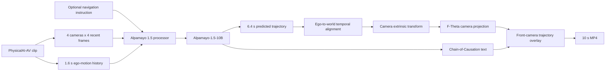

# Alpamayo 1.5 VLA: Multi-Camera Reasoning and Trajectory Projection

An end-to-end reproduction and visualization workflow for NVIDIA Alpamayo 1.5. This repository runs multi-camera driving inference on clips from the NVIDIA PhysicalAI Autonomous Vehicles dataset, predicts future ego trajectories, produces Chain-of-Causation (CoC) explanations, projects the predicted path back into the calibrated front camera, and exports synchronized demonstration videos.

[](assets/videos/alpamayo_2x2_10s.mp4)

**This animated cover is generated from the combined video. Click it to open the complete synchronized 2x2 MP4 with full image quality.**

- Resolution: `1920x1080`
- Duration: `10.0 seconds`
- Frame rate: `5 FPS`
- Layout: four synchronized scenarios in a `2x2` grid
- Overlays: predicted driving corridor, predicted trajectory, ground-truth trajectory, CoC text, and minADE

## Overview

The upstream Alpamayo 1.5 model does not consume an arbitrary 10-second MP4 in one forward pass. Its supported inference sample contains recent multi-camera observations and ego-motion history at a single reference time. This project turns that interface into a continuous video workflow by running five real model inferences over a 10-second segment, one every two seconds, then temporally aligning each prediction with the current camera frame.

Each prediction window uses:

- Four cameras: cross-left, front-wide, cross-right, and front-telephoto
- Four recent frames per camera
- `1.6 seconds` of ego-motion history sampled at `10 Hz`
- One navigation instruction when navigation conditioning is enabled

Each window produces:

- A `6.4-second` future ego trajectory with 64 waypoints
- A natural-language Chain-of-Causation explanation
- A camera-calibrated visualization of the future path
- A per-window minADE value against the dataset ground truth

## Start Here

If you have never deployed a CUDA model, used SSH, authenticated with Hugging Face, or moved a model cache between servers, start with the fully guided tutorial:

**[Beginner's End-to-End Reproduction Guide](docs/BEGINNER_GUIDE.md)**

It covers the complete verified path used for this project:

1. Checking the GPU, CUDA, Python, and disk on a remote server
2. Cloning the official NVIDIA repository
3. Installing `uv`, Python 3.12, PyTorch, and project dependencies
4. Requesting access to every gated Hugging Face resource
5. Logging in without exposing an access token
6. Downloading the example dataset and approximately 22 GB of model weights
7. Diagnosing dataset `403`, Cosmos access, FlashAttention, and CUDA OOM errors
8. Moving code and Hugging Face caches from an 8 GB RTX 4060 Ti server to an A100 server
9. Running the official flow with the SDPA fallback
10. Running the 10-second sliding-window videos and the 2x2 composite
11. Downloading results to a Windows computer and verifying the MP4 files

## Demonstrations

| Panel | Scenario | Navigation instruction | Dataset clip | Start | Video | Metadata |
|---|---|---|---|---:|---|---|
| A | Obstacle avoidance | None | `030c760c-ae38-49aa-9ad8-f5650a545d26` | 5.1 s | [MP4](assets/videos/alpamayo_10s_obstacle_result.mp4) | [JSON](assets/metadata/obstacle_avoidance.json) |
| B | Left turn | `Turn left in 18m` | `c9c045a3-ebe9-4569-9ce3-a44068cf2e3b` | 2.0 s | [MP4](assets/videos/alpamayo_10s_left_turn_18m.mp4) | [JSON](assets/metadata/left_turn_18m.json) |
| C | Right turn | `Turn right in 14m` | `82f9f689-6efb-4eb3-af10-070b52eeca22` | 4.0 s | [MP4](assets/videos/alpamayo_10s_right_turn_14m.mp4) | [JSON](assets/metadata/right_turn_14m.json) |
| D | Near left turn | `Turn left in 5m` | `b7dd3c46-ca94-4ffa-a8cf-3a13350c8aba` | 5.0 s | [MP4](assets/videos/alpamayo_10s_left_turn_5m.mp4) | [JSON](assets/metadata/left_turn_5m.json) |

The three navigation-conditioned scenes were selected because their ground-truth motion contains visible turns rather than nearly straight driving. The resulting videos therefore show both the model's lateral intent and the effect of navigation conditioning.

## Visual Encoding

The rendered front-camera overlay uses the following convention:

- **Translucent blue region:** a driving corridor derived from the model-predicted center trajectory
- **Cyan/blue center line:** model-predicted future ego trajectory
- **Red line:** dataset ground-truth future trajectory
- **White markers:** sampled points along the predicted trajectory
- **Top-right plot:** ego-frame bird's-eye comparison of history, prediction, and ground truth
- **Bottom panel:** Chain-of-Causation explanation and minADE

> [!IMPORTANT]
> The blue corridor is a visualization derived by expanding the predicted center trajectory by `1.4 m` on each side. Alpamayo does not separately predict these corridor boundaries, and the overlay must not be interpreted as lane-boundary segmentation.

## Pipeline



### Sliding-Window Inference

For a segment starting at time `t_start`, predictions are generated at:

```text
t_start + [0, 2, 4, 6, 8] seconds
```

The model is loaded once and reused across all windows. The current video frame uses the most recent available prediction. Predictions are transformed from their original ego frame into the ego frame of the current video timestamp, preventing an old trajectory from being pasted into a later frame without motion compensation.

### Camera Projection

The dataset supplies both the `camera_front_wide_120fov` F-Theta camera model and the camera-to-vehicle rigid transform. For a trajectory point predicted in the ego frame at reference time `t0`, the renderer computes:

```text
p_world      = T_world_ego(t0) * p_prediction
p_ego(t)     = inverse(T_world_ego(t)) * p_world
p_camera(t)  = inverse(T_ego_camera) * p_ego(t)
pixel        = FThetaProject(p_camera(t))
```

Only finite points in front of the camera and inside the image bounds are rendered. The same transform is applied to the ground-truth trajectory.

## Quantitative Summary

The following values summarize the five inference windows in each 10-second segment. `minADE` is computed in the local ego `x-y` plane. Because these demonstrations use one trajectory sample per window, the reported minADE is also the ADE of that single sample.

| Scenario | Mean minADE | Minimum | Maximum |
|---|---:|---:|---:|
| Obstacle avoidance | 0.724 m | 0.425 m | 1.333 m |
| Left turn, 18 m | 1.892 m | 0.645 m | 4.819 m |
| Right turn, 14 m | 2.873 m | 0.487 m | 7.015 m |
| Left turn, 5 m | 1.402 m | 0.814 m | 1.913 m |

These clips are qualitative demonstrations, not a benchmark split. The larger errors during turns illustrate the difficulty of navigation-conditioned multimodal prediction and should not be interpreted as a complete evaluation of Alpamayo 1.5.

## Repository Layout

```text
.
|-- README.md
|-- assets
|   |-- images
|   |   |-- alpamayo_2x2_10s_cover.gif
|   |   |-- alpamayo_2x2_10s_poster.png
|   |   |-- left_turn_18m_poster.png
|   |   |-- right_turn_14m_poster.png
|   |   `-- left_turn_5m_poster.png
|   |-- metadata
|   |   |-- composite_2x2.json
|   |   |-- obstacle_avoidance.json
|   |   |-- left_turn_18m.json
|   |   |-- right_turn_14m.json
|   |   `-- left_turn_5m.json
|   `-- videos
|       |-- alpamayo_2x2_10s.mp4
|       |-- alpamayo_10s_obstacle_result.mp4
|       |-- alpamayo_10s_left_turn_18m.mp4
|       |-- alpamayo_10s_right_turn_14m.mp4
|       `-- alpamayo_10s_left_turn_5m.mp4
|-- docs
|   |-- BEGINNER_GUIDE.md
|   |-- ENVIRONMENT.md
|   `-- REPRODUCTION.md
`-- scripts
    |-- check_environment.py
    |-- alpamayo_10s_sliding_demo.py
    `-- alpamayo_three_scenes_and_grid.py
```

## Requirements

This repository contains the orchestration and visualization layer. The upstream model implementation and its dependencies must be installed separately.

Tested setup:

- Ubuntu Linux
- Python `3.12.3`
- `uv 0.11.31`
- PyTorch `2.8.0+cu128`
- CUDA `12.8`
- `physical-ai-av 0.2.0`
- `transformers 4.57.1`
- NVIDIA A100 `80 GB`
- Alpamayo attention implementation: PyTorch SDPA
- FFmpeg with H.264, `drawtext`, and `xstack` support

The official single-sample inference requires substantially more memory than an 8 GB consumer GPU. Initial setup was verified on an RTX 4060 Ti, but complete model inference was executed on an A100.

See the [complete environment and version reference](docs/ENVIRONMENT.md) for all 17 Python
package versions and an automated device check.

## Exact Clone-to-Run Workflow

The official repository and this repository have different responsibilities:

- `NVlabs/alpamayo1.5` provides the model implementation, dataset loader, processor, and locked
  Python environment.
- `130070/Alpamayo1.5-VLA` provides one environment checker and two demo scripts for
  sliding-window inference, trajectory projection, rendering, and the 2x2 composite.

Keep the repositories next to each other. Do not copy NVIDIA source code or gated weights into
this repository.

### 1. Clone both repositories

```bash
cd "$HOME"
git clone https://github.com/NVlabs/alpamayo1.5.git
git clone https://github.com/130070/Alpamayo1.5-VLA.git
git -C "$HOME/alpamayo1.5" checkout f42e594aaf8b50dcd2cbb359d62e3ffc7b12fcf8
```

The resulting directories should be:

```text
~/alpamayo1.5/          # official NVIDIA code and Python environment
~/Alpamayo1.5-VLA/      # checker, two demo scripts, documentation, and example videos
```

The explicit checkout fixes the official source and `uv.lock` to the version documented here.

### 2. Create the official Python environment

```bash
cd "$HOME/alpamayo1.5"
uv python install 3.12
uv venv a1_5_venv --python 3.12
source a1_5_venv/bin/activate
uv sync --active --no-install-package flash-attn
```

The last command installs the official locked dependencies but skips FlashAttention. The two demo
scripts load the model with PyTorch SDPA, so FlashAttention is not required.

### 3. Authenticate with Hugging Face

Accept the terms for the dataset, Alpamayo model, and Cosmos model listed in the
[beginner guide](docs/BEGINNER_GUIDE.md), then run:

```bash
hf auth login
hf auth whoami
```

Paste a read-only token only into the hidden login prompt. Never put it in a script or command-line
argument.

### 4. Copy this repository's scripts into the official root

```bash
cp "$HOME/Alpamayo1.5-VLA/scripts/"*.py "$HOME/alpamayo1.5/"
cd "$HOME/alpamayo1.5"
```

Confirm that three files were copied:

```bash
ls -l \
  check_environment.py \
  alpamayo_10s_sliding_demo.py \
  alpamayo_three_scenes_and_grid.py
```

The last two files are the actual demo programs. `check_environment.py` performs readiness checks
and does not run inference.

### 5. Check the machine before downloading or loading the model

```bash
source a1_5_venv/bin/activate
mkdir -p outputs
set -o pipefail
python check_environment.py --check-hf-access | tee outputs/environment-check.txt
```

Continue only when the final summary reports zero failures. Missing model cache entries are warnings
before the first run because the model has not been downloaded yet.

### 6. Run the first 10-second scene

```bash
export PYTHONUNBUFFERED=1
# Optional only when direct Hugging Face access is unavailable:
# export HF_ENDPOINT=https://hf-mirror.com

python alpamayo_10s_sliding_demo.py 2>&1 \
  | tee outputs/alpamayo_10s_run.log
```

The first run downloads the authorized sample data and approximately 22 GB of model files. It then
runs five inference windows, saves each completed window to a resumable `.pt` cache, and renders the
obstacle-avoidance MP4.

### 7. Run the other three scenes and create the 2x2 video

Do this only after Step 6 has produced
`outputs/alpamayo_10s/alpamayo_10s_result.mp4`:

```bash
python alpamayo_three_scenes_and_grid.py 2>&1 \
  | tee outputs/alpamayo_batch_run.log
```

The final file is:

```text
outputs/alpamayo_2x2/alpamayo_2x2_10s.mp4
```

### 8. Verify the result

```bash
ffprobe -v error \
  -select_streams v:0 \
  -show_entries stream=codec_name,width,height,r_frame_rate,nb_frames,duration \
  -of json \
  outputs/alpamayo_2x2/alpamayo_2x2_10s.mp4
```

Expected: H.264, `1920x1080`, `5 FPS`, `10 seconds`, and `50` frames.

Use the [beginner guide](docs/BEGINNER_GUIDE.md) for the complete clone-to-demo workflow. See [docs/REPRODUCTION.md](docs/REPRODUCTION.md) for implementation-focused configuration, projection, validation, and troubleshooting notes.

## Running the Single-Scene Demo

Edit the constants near the top of `scripts/alpamayo_10s_sliding_demo.py` if a different clip or time range is required, then run:

```bash
export HF_ENDPOINT=https://hf-mirror.com  # Optional; remove if direct Hugging Face access works.
PYTHONUNBUFFERED=1 python alpamayo_10s_sliding_demo.py
```

The script writes:

```text
outputs/alpamayo_10s/
|-- alpamayo_10s_input.mp4
|-- alpamayo_10s_result.mp4
|-- alpamayo_10s_result_poster.png
|-- alpamayo_10s_meta.json
`-- alpamayo_10s_sliding_results.pt
```

The `.pt` file is an incremental inference cache. If execution is interrupted, completed windows are retained and reused on the next run.

## Running the Three Navigation Scenes and 2x2 Composite

Place both scripts in the upstream repository root, then run:

```bash
export HF_ENDPOINT=https://hf-mirror.com
PYTHONUNBUFFERED=1 python alpamayo_three_scenes_and_grid.py
```

The batch script:

1. Loads Alpamayo once with SDPA.
2. Runs five windows for each of the three navigation scenes.
3. Releases GPU model memory.
4. Decodes and renders all scene videos on CPU.
5. Uses FFmpeg to create a synchronized `1920x1080` 2x2 MP4.

## Inference Configuration

The demonstration uses the following sampling configuration:

```python
top_p = 0.98
temperature = 0.6
num_traj_samples = 1
max_generation_length = 256
attention = "sdpa"
```

Random seeds are set per inference window for repeatability. Increase `num_traj_samples` only after accounting for additional compute and memory requirements.

## GPU Coexistence and Memory Guards

The A100 used for this reproduction already had another GPU process occupying approximately `44 GB`. To avoid stopping or modifying that process, the demo applies two memory checks:

- At least `30,000 MiB` must be free before model loading.
- At least `8,000 MiB` must remain before each inference window.

Observed additional memory for Alpamayo was approximately `21.8 GB`. After inference, model memory was explicitly released before CPU rendering and video encoding.

These checks reduce risk but do not provide hard GPU resource isolation. For production workloads, run on a dedicated GPU or use an appropriate scheduler.

## Limitations

- This is an inference and visualization project, not model training code.
- Model weights and dataset files are not redistributed.
- A 10-second video is processed through supported sliding windows, not as one monolithic model input.
- The predicted corridor is derived from the center trajectory and is not lane segmentation.
- The demonstration uses one trajectory sample per window.
- minADE values are clip-specific and are not a replacement for dataset-wide evaluation.
- Navigation instructions remain fixed within each demonstration segment.
- Camera overlays depend on valid dataset intrinsics, extrinsics, and ego-motion poses.

## References

- [NVIDIA Alpamayo 1.5](https://github.com/NVlabs/alpamayo1.5)
- [Alpamayo-1.5-10B on Hugging Face](https://huggingface.co/nvidia/Alpamayo-1.5-10B)
- [NVIDIA PhysicalAI Autonomous Vehicles Dataset](https://huggingface.co/datasets/nvidia/PhysicalAI-Autonomous-Vehicles)

## Acknowledgements

This project builds on the NVIDIA Alpamayo 1.5 codebase, model, and PhysicalAI Autonomous Vehicles dataset. All upstream licenses, access conditions, and usage restrictions remain applicable. This repository contains only original orchestration scripts and generated demonstration artifacts; it does not redistribute NVIDIA model weights or dataset source files.
